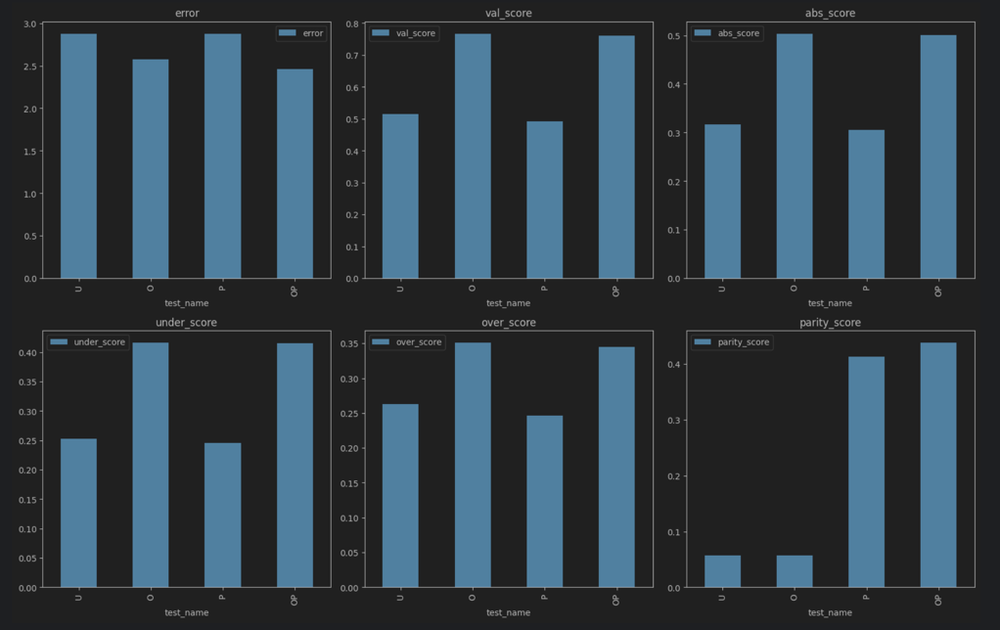
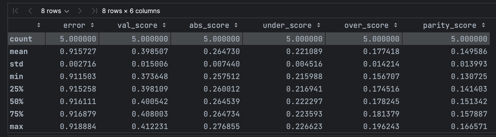
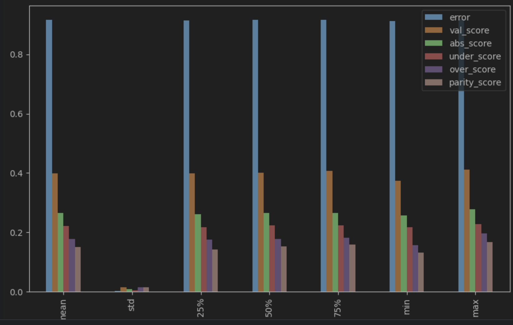
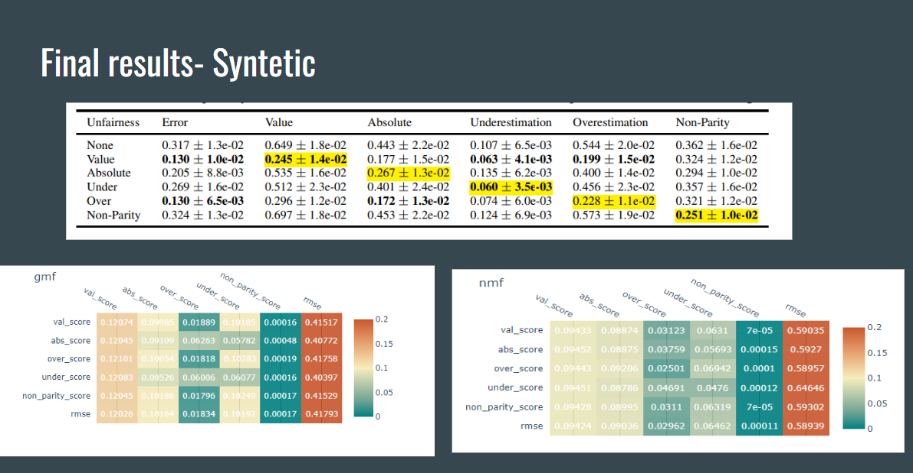
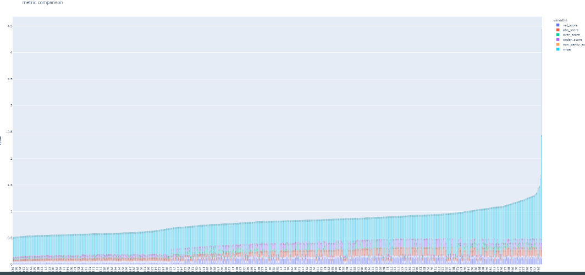
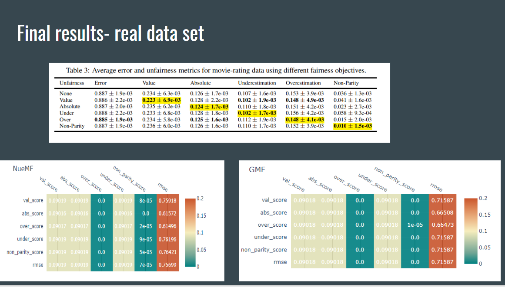
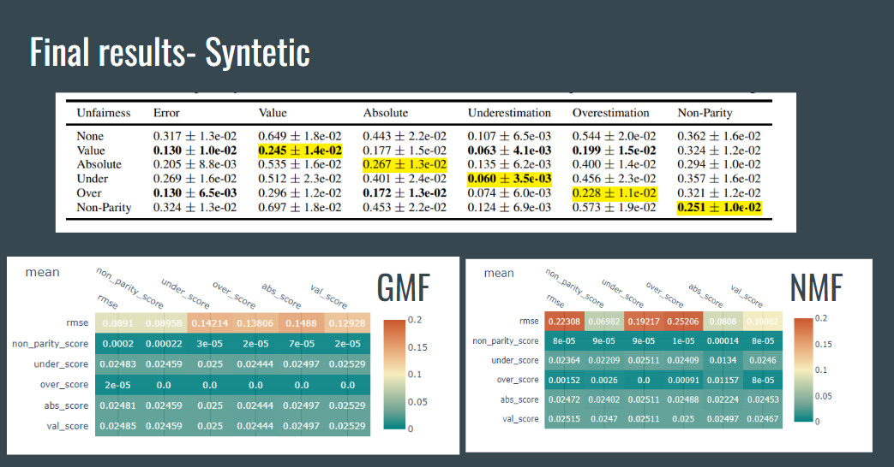
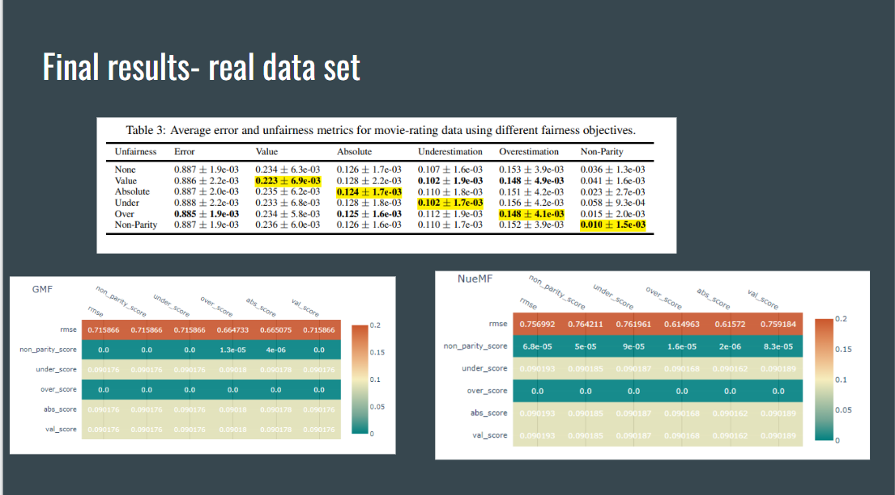

# fairness-optimization: Recommender Systems and Fairness Metrics

This repository contains code for implementing the methods outlined in the research article, "Fairness in
Collaborative-Filtering Recommender Systems". The article highlights the issue of fairness in collaborative-filtering
recommender systems, which can be affected by historical data bias. Biased data can lead to unfair recommendations for
users from minority groups.

In this work, we propose four new fairness metrics that address various types of unfairness, as existing fairness
metrics have proven to be insufficient. These new metrics can be optimized by adding fairness terms to the learning
objective. We have conducted experiments on synthetic and real data, which show that our proposed metrics outperform the
baseline, and the fairness objectives effectively help minimize unfairness.

The repository contains the following files:

fairness_metrics.py: This file contains the implementation of the four new fairness metrics proposed in the article.

[models](models): This file contains the implementation of the new recommender system models that use
fairness-optimization.

[artifacts](artifacts): This directory contains training artifacts (dictionaries with all the training meta-data)

[methods.py](fairness_methods%2Fmethods.py): This file contains the code for each fairness metrics from the article.

[article_recovery.ipynb](article_recovery.ipynb): This jupyter notebook recovery the article results on movieLen data &
synthetic data.

To use this repository, you can download or clone it to your local machine.
The recommended way to run the code is to create a virtual environment using Python 3.9 or higher.
Then, install the required dependencies by running pip install -r requirements.txt.

After installing the dependencies, you can run the [article_recovery.ipynb](article_recovery.ipynb).
This script will train the basic model, optimize the fairness metrics, and evaluate the model on the test data.

We hope that this repository will be useful for researchers and practitioners who are interested in developing more fair
collaborative-filtering recommender systems. Please feel free to reach out to us with any questions or feedback.

## resources

Article: ["Beyond Parity:Fairness Objectives for Collaborative Filtering"](https://arxiv.org/pdf/1705.08804.pdf)

Explanation:

1. [Youtube link](https://www.google.com/search?q=code+for+Beyond+Parity%3A+Fairness+Objectives+for+Collaborative+Filtering&rlz=1C5GCEM_enIL1032IL1032&sxsrf=ALiCzsZACsJifJOqejrgmEyimTqkxszmNw%3A1671954851128&ei=owGoY9G7B8GW9u8PzPWjyAo&ved=0ahUKEwiRme2XpZT8AhVBi_0HHcz6CKkQ4dUDCA8&uact=5&oq=code+for+Beyond+Parity%3A+Fairness+Objectives+for+Collaborative+Filtering&gs_lcp=Cgxnd3Mtd2l6LXNlcnAQA0oECEEYAEoECEYYAFAAWABg_AFoAHABeACAAX-IAX-SAQMwLjGYAQCgAQHAAQE&sclient=gws-wiz-serp#fpstate=ive&vld=cid:f93e384b,vid:uMApSkGGQKs)
2. [Lecture](https://www.google.com/search?q=Beyond+Parity%3A+Fairness+Objectives+for+Collaborative+Filtering%3A&oq=Beyond+Parity%3A+Fairness+Objectives+for+Collaborative+Filtering%3A&aqs=chrome..69i57j35i39l2j0i22i30.871j0j7&sourceid=chrome&ie=UTF-8#fpstate=ive&vld=cid:9fe4e62d,vid:9EWSuoNqBQo)

## metrics

1. **val_score**:
   "measures inconsistency in signed estimation error across the user types"-
   The concept of value unfairness refers to situations where one group of users consistently receives higher or lower
   recommendations than their actual preferences. If there is an equal balance of overestimation and underestimation,
   or if both groups of users experience errors in the same direction and magnitude, then the value unfairness is
   minimized. However, when one group is consistently overestimated and the other group is consistently underestimated,
   then the value unfairness becomes more significant. A practical example of value unfairness in a course
   recommendation system could be male students being recommended STEM courses even if they are not interested in such
   topics, while female students are not recommended STEM courses even if they are interested in them.

$$
U_{val} = 1/n \sum_{j=1}^{n} \left |(E_{g}   [y \right ]_{j} - E_{g} \left [r \right ]_{j}) - (E_{\neg g}
\left [y \right ]_{j} - E_{\neg g} \left [r \right ]_{j})|
$$

2. **abs_score**:
   "measures inconsistency in absolute estimation error across user types"-
   Absolute unfairness is a measure of recommendation quality that is unsigned and provides a single statistic for each
   user type. It assesses the performance of the recommendation system for each group of users, and if one group
   has a small reconstruction error while the other group has a large one, then the first group is at an unfair
   advantage. Unlike value unfairness, absolute unfairness does not take into account the direction of error.
   For example, if female students are recommended courses that are 0.5 points below their true preferences,
   and male students are recommended courses that are 0.5 points above their true preferences, there is no
   absolute unfairness. However, if female students are recommended courses that are off by 2 points in either
   direction, while male students are recommended courses within 1 point of their true preferences, then absolute
   unfairness is high, even if value unfairness is low.

$$
U_{abs} = \frac{1}{n} \sum_{j=1}^{n} \left| \left|E_{g}[y]{j} - E{g}[r]{j}\right| - \left|E{\neg g}[y]{j} - E{\neg
g}[r]_{j}\right| \right|
$$

3. **under_score**:
   "measures inconsistency in how much the predictions underestimate the true ratings"-
   The concept of underestimation unfairness is particularly relevant in situations where it is more important to avoid
   missing relevant recommendations than to provide additional recommendations. In cases where a highly capable
   student may not be recommended a course or subject in which they would excel,
   underestimation can have a significant impact. Therefore, the avoidance of underestimation can be considered a
   critical objective for recommendation systems in certain contexts.

$$
U_{under} = \frac{1}{n} \sum_{j=1}^{n} \left| \max \left(0, E_{g}[r]{j} - E{g}[y]{j}\right) - \max \left(0, E{\neg
g}[r]{j} - E{\neg g}[y]_{j}\right) \right|
$$

4. **over_score**:
   "measures inconsistency in how much the predictions overestimate the true ratings"-
   Overestimation unfairness is a relevant concept in situations where providing too many recommendations can be
   overwhelming for users. In cases where users must spend significant time evaluating each recommended item,
   overestimation can be especially detrimental, as it essentially wastes the user's time.
   Therefore, it is important to avoid overestimation in certain contexts. Furthermore, uneven amounts of overestimation
   can have different effects on different types of users, leading to unequal time costs for each group.

$$
U_{over} = \frac{1}{n} \sum_{j=1}^{n} \left| \max \left(0, E_{g}[y]{j} - E{g}[r]{j}\right) - \max \left(0, E{\neg
g}[y]{j} - E{\neg g}[r]_{j}\right) \right|
$$

5. **par_score**:
   Kamishima et al. proposed a non-parity unfairness measure that can be computed using a regularization term.
   This measure involves calculating the absolute difference between the average ratings of disadvantaged users and
   advantaged users. By comparing the overall average ratings of each group, this measure provides insight into the
   extent to which a recommendation system may be unfair in terms of rating predictions.

$$
U_{par} = \left| E_{g}[y] - E{\neg g}[y] \right|
$$

## Article Experiments

In the article ["Beyond Parity:Fairness Objectives for Collaborative Filtering"] we can found few experiments that divide to 2 different data type:

1. **Syntetic Data**

   In this study, we evaluate different unfairness metrics using standard matrix factorization under various sampling conditions. We conduct five random trials and report the average scores in Fig. 1. The settings are labeled as U (uniform user groups and observation probabilities), O (uniform user groups and biased observation probabilities), P (biased user group populations and uniform observations), and B (biased populations and observations).

   The statistics indicate that different forms of underrepresentation contribute to various types of unfairness. Uniform data is the most fair, biased observations is more fair, biased populations is worse, and biasing populations and observations is the most unfair, except for non-parity which is heavily amplified by biased observations but unaffected by biased populations. A high non-parity score does not necessarily indicate unfairness due to the expected imbalance in labeled ratings. The other unfairness metrics describe unfair behavior by the rating predictor. These tests show that unfairness can occur even when the ratings accurately represent user preferences, due to imbalanced populations or observations.

2. **Real Data**

   The study uses the Movielens Million Dataset, consisting of ratings by 6,040 users of 3,883 movies, annotated with demographic variables and genres. The study selects genres that exhibit gender imbalance and considers only users who rated at least 50 of these movies. After filtering, the dataset has 2,953 users and 1,006 movies. The study conducts five trials and evaluates each metric on the testing set. Results show that optimizing each unfairness metric leads to the best performance on that metric without a significant change in reconstruction error. Optimizing value unfairness leads to the most decrease in under- and overestimation, while optimizing non-parity leads to an increase or no change in almost all other unfairness metrics.

   

   

## models

1. **basif MF**:
It assumes a set of users and items, where each user has a variable representing their group, and each item has a variable representing its group. 
The preference score of each user for each item is represented by the entries in a rating matrix. The matrix-factorization learning algorithm seeks to learn the parameters from observed ratings by minimizing a regularized, 
squared reconstruction error. The algorithm uses the Adam optimizer, which combines adaptive learning rates with momentum, to minimize the non-convex objective.

2. **GMF**:
Model architecture:
Flatten users and items vectors as input 
2 embedding laters ( size is hyperparam)
Element wise product
Relu activation

3. **NeuMF**:
Input Layer: Flatten users and items vectors as input
Embedding Layer: The embedding layer maps the user and item to latent space.
Multi-Layer Perceptron : The MLP takes the embeddings as input and passes them through several fc layers with non-linear activation functions.
Matrix Factorization: calculates the inner product of the user and item embeddings and produces a single output.
Output Layer: relu activation

## Hyperparam tuning 
param optimiaztion using random search:

## model results:

## Final thoughts:

This project examines 3 models using 5 fairness metrics and RMSE as objective & evaluation functions
In both real and synthetic data, we successfully improve the paper baseline models ( matrix factorization).
Compared to the NueMF model, the GMF performs better in synthetic and real data (as shown in the final tables).
Fairness can be improved dramatically without harming RMSE

